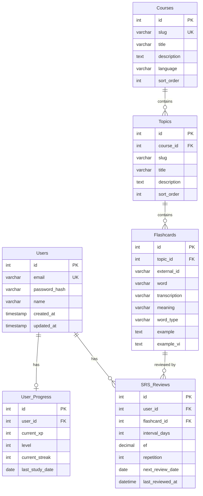

# 📊 PKAstudy — Tài liệu các trường dữ liệu (Data Schema)

> Tài liệu mô tả chi tiết tất cả các bảng CSDL (MySQL), cấu trúc dữ liệu Frontend và các key lưu trữ localStorage trong dự án PKAstudy.

---

## 📑 Mục lục

1. [Database (MySQL)](#1-database-mysql)
   - [Users](#11-users)
   - [User_Progress](#12-user_progress)
   - [Courses](#13-courses)
   - [Topics](#14-topics)
   - [Flashcards](#15-flashcards)
   - [SRS_Reviews](#16-srs_reviews)
2. [Frontend Data Models](#2-frontend-data-models)
   - [Word (Từ vựng)](#21-word-từ-vựng)
   - [Topic (Chủ đề)](#22-topic-chủ-đề)
   - [Course (Khóa học)](#23-course-khóa-học)
   - [TOEIC Part](#24-toeic-part)
   - [TOEIC Question](#25-toeic-question)
3. [LocalStorage Data](#3-localstorage-data)
   - [Dashboard Progress](#31-dashboard-progress)
   - [XP System](#32-xp-system)
   - [SRS Queue](#33-srs-queue)
   - [Streak System](#34-streak-system)
   - [User Stats](#35-user-stats)
   - [Remembered Words](#36-remembered-words)
   - [Custom Courses](#37-custom-courses)
4. [API Response Formats](#4-api-response-formats)
5. [ERD Diagram](#5-erd-diagram)

---

## 1. Database (MySQL)

Database name: `pkastudy`

### 1.1 Users

Bảng lưu thông tin người dùng.

| Trường | Kiểu | Ràng buộc | Mô tả |
|--------|------|-----------|-------|
| `id` | INT | PK, AUTO_INCREMENT | ID người dùng |
| `email` | VARCHAR(255) | NOT NULL, UNIQUE | Email đăng nhập |
| `password_hash` | VARCHAR(255) | NOT NULL | Mật khẩu đã mã hóa (bcrypt) |
| `name` | VARCHAR(255) | DEFAULT NULL | Tên hiển thị |
| `created_at` | TIMESTAMP | DEFAULT CURRENT_TIMESTAMP | Ngày tạo |
| `updated_at` | TIMESTAMP | ON UPDATE CURRENT_TIMESTAMP | Ngày cập nhật |

> **Ghi chú:** Đăng nhập Google sẽ tạo `password_hash` ngẫu nhiên (crypto.randomBytes).

---

### 1.2 User_Progress

Bảng theo dõi tiến trình học tập tổng quan của người dùng.

| Trường | Kiểu | Ràng buộc | Mô tả |
|--------|------|-----------|-------|
| `id` | INT | PK, AUTO_INCREMENT | ID bản ghi |
| `user_id` | INT | FK → Users(id), ON DELETE CASCADE | Liên kết đến user |
| `current_xp` | INT | NOT NULL, DEFAULT 0 | Tổng XP hiện tại |
| `level` | INT | NOT NULL, DEFAULT 1 | Level hiện tại |
| `current_streak` | INT | NOT NULL, DEFAULT 0 | Chuỗi ngày học liên tiếp |
| `last_study_date` | DATE | NULL | Ngày học gần nhất |
| `created_at` | TIMESTAMP | DEFAULT CURRENT_TIMESTAMP | Ngày tạo |
| `updated_at` | TIMESTAMP | ON UPDATE CURRENT_TIMESTAMP | Ngày cập nhật |

---

### 1.3 Courses

Bảng lưu các khóa học/bộ từ vựng.

| Trường | Kiểu | Ràng buộc | Mô tả |
|--------|------|-----------|-------|
| `id` | INT | PK, AUTO_INCREMENT | ID khóa học |
| `slug` | VARCHAR(100) | NOT NULL, UNIQUE | URL-friendly ID (vd: `toeic-basic`) |
| `title` | VARCHAR(255) | NOT NULL | Tên khóa học |
| `description` | TEXT | DEFAULT NULL | Mô tả khóa học |
| `language` | VARCHAR(20) | NOT NULL | Ngôn ngữ (vd: `en`) |
| `sort_order` | INT | NOT NULL, DEFAULT 0 | Thứ tự sắp xếp |
| `created_at` | TIMESTAMP | DEFAULT CURRENT_TIMESTAMP | Ngày tạo |
| `updated_at` | TIMESTAMP | ON UPDATE CURRENT_TIMESTAMP | Ngày cập nhật |

---

### 1.4 Topics

Bảng lưu các chủ đề từ vựng trong mỗi khóa học.

| Trường | Kiểu | Ràng buộc | Mô tả |
|--------|------|-----------|-------|
| `id` | INT | PK, AUTO_INCREMENT | ID chủ đề |
| `course_id` | INT | FK → Courses(id), ON DELETE CASCADE | Liên kết khóa học |
| `slug` | VARCHAR(120) | DEFAULT NULL | URL-friendly ID |
| `title` | VARCHAR(255) | NOT NULL | Tên chủ đề (vd: `Lesson 1: Contracts`) |
| `description` | TEXT | DEFAULT NULL | Mô tả chủ đề |
| `sort_order` | INT | NOT NULL, DEFAULT 0 | Thứ tự sắp xếp |
| `created_at` | TIMESTAMP | DEFAULT CURRENT_TIMESTAMP | Ngày tạo |
| `updated_at` | TIMESTAMP | ON UPDATE CURRENT_TIMESTAMP | Ngày cập nhật |

**Index:** `idx_topics_course_id (course_id)`

---

### 1.5 Flashcards

Bảng lưu từ vựng (flashcard) trong mỗi chủ đề.

| Trường | Kiểu | Ràng buộc | Mô tả |
|--------|------|-----------|-------|
| `id` | INT | PK, AUTO_INCREMENT | ID nội bộ flashcard |
| `topic_id` | INT | FK → Topics(id), ON DELETE CASCADE | Liên kết chủ đề |
| `external_id` | VARCHAR(50) | DEFAULT NULL | ID hiển thị bên ngoài (vd: `w001`) |
| `word` | VARCHAR(255) | NOT NULL | Từ vựng |
| `transcription` | VARCHAR(255) | DEFAULT NULL | Phiên âm IPA |
| `meaning` | VARCHAR(255) | NOT NULL | Nghĩa tiếng Việt |
| `word_type` | VARCHAR(100) | DEFAULT NULL | Loại từ (noun, verb, adj...) |
| `example` | TEXT | DEFAULT NULL | Câu ví dụ tiếng Anh |
| `example_vi` | TEXT | DEFAULT NULL | Câu ví dụ tiếng Việt |
| `language` | VARCHAR(20) | DEFAULT 'en' | Ngôn ngữ của từ (en, ko, ...) |
| `created_at` | TIMESTAMP | DEFAULT CURRENT_TIMESTAMP | Ngày tạo |
| `updated_at` | TIMESTAMP | ON UPDATE CURRENT_TIMESTAMP | Ngày cập nhật |

**Index:** `idx_flashcards_topic_id (topic_id)`

---

### 1.6 SRS_Reviews

Bảng theo dõi lịch ôn tập Spaced Repetition (thuật toán SM-2).

| Trường | Kiểu | Ràng buộc | Mô tả |
|--------|------|-----------|-------|
| `id` | INT | PK, AUTO_INCREMENT | ID bản ghi |
| `user_id` | INT | FK → Users(id), ON DELETE CASCADE | Liên kết user |
| `flashcard_id` | INT | FK → Flashcards(id), ON DELETE CASCADE | Liên kết flashcard |
| `interval_days` | INT | NOT NULL, DEFAULT 1 | Khoảng cách ôn tập (ngày) |
| `ef` | DECIMAL(4,2) | NOT NULL, DEFAULT 2.50 | Easiness Factor (SM-2) |
| `repetition` | INT | NOT NULL, DEFAULT 0 | Số lần ôn tập thành công liên tiếp |
| `next_review_date` | DATE | NOT NULL | Ngày cần ôn tập tiếp theo |
| `last_reviewed_at` | DATETIME | DEFAULT NULL | Lần ôn gần nhất |
| `fail_count` | INT | NOT NULL, DEFAULT 0 | Số lần quên từ |
| `created_at` | TIMESTAMP | DEFAULT CURRENT_TIMESTAMP | Ngày tạo |
| `updated_at` | TIMESTAMP | ON UPDATE CURRENT_TIMESTAMP | Ngày cập nhật |

**Constraints:**
- `UNIQUE (user_id, flashcard_id)` — mỗi user chỉ có 1 bản ghi SRS cho mỗi flashcard
- **Index:** `idx_srs_reviews_user_due (user_id, next_review_date)`

---

## 2. Frontend Data Models

### 2.1 Word (Từ vựng)

Cấu trúc 1 từ vựng trong frontend (file `toeicBasicLessons.js` và custom courses).

```js
{
  id: "w001",              // String — ID duy nhất
  word: "abide by",        // String — Từ vựng
  language: "en",          // String — Ngôn ngữ ("en", "ko", ...)
  transcription: "/əˈbaɪd baɪ/",  // String — Phiên âm IPA
  mean: "tuân theo",       // String — Nghĩa tiếng Việt
  wordtype: "phrasal verb", // String — Loại từ
  example: "All staff must abide by...", // String — Ví dụ EN
  example_vi: "Tất cả nhân viên...",     // String — Ví dụ VI
  remembered: false        // Boolean — Đã thuộc chưa (chỉ dùng trong static data)
}
```

### 2.2 Topic (Chủ đề)

```js
{
  id: "toeic-contract",    // String — Slug ID
  title: "📄 Lesson 1: Contracts", // String — Tên chủ đề
  description: "Từ vựng TOEIC...", // String — Mô tả
  wordCount: 12,           // Number — Số từ
  words: [/* Word[] */]    // Array<Word> — Danh sách từ vựng
}
```

### 2.3 Course (Khóa học)

```js
{
  id: "toeic-basic",       // String — Course ID
  title: "600 Essential Words for the TOEIC", // String
  lang: "en",              // String — Ngôn ngữ
  topics: [/* Topic[] */]  // Array<Topic> — Danh sách chủ đề
}
```

### 2.4 TOEIC Part

```js
{
  id: "part1",             // String — Part ID
  label: "Part 1",         // String — Nhãn hiển thị
  title: "Photographs",    // String — Tên phần thi
  desc: "Nghe và chọn...", // String — Mô tả
  icon: "🖼️",             // String — Emoji icon
  questionCount: 6,        // Number — Số câu hỏi
  questions: [/* Question[] */] // Array — Danh sách câu hỏi
}
```

### 2.5 TOEIC Question

**Listening (Part 1-4):**
```js
{
  id: "p1q1",
  audioText: "A man is sitting...",   // String — Nội dung audio
  question: "What does the woman...?", // String — Câu hỏi (Part 3-4)
  options: ["A", "B", "C", "D"],      // String[] — Đáp án
  correct: 0,                          // Number — Index đáp án đúng
  explanation: "Giải thích..."         // String — Giải thích
}
```

**Reading (Part 5-7):**
```js
{
  id: "p5q1",
  text: "The company _____ its...",    // String — Câu cần điền
  passage: "Notice: The office...",    // String — Đoạn văn (Part 7)
  question: "When should...?",         // String — Câu hỏi (Part 7)
  options: ["A", "B", "C", "D"],
  correct: 1,
  explanation: "..."
}
```

---

## 3. LocalStorage Data

### 3.1 Dashboard Progress

**Key:** `pka_dashboard_progress_v1`

Lưu trữ theo `userKey` (vd: `guest`, `user:john`).

```js
{
  "guest": {
    streak: 0,                    // Number — Chuỗi ngày liên tiếp
    totalXp: 0,                   // Number — Tổng XP
    dailyXp: 0,                   // Number — XP hôm nay
    currentDate: "2026-05-15",    // String — Ngày hiện tại (auto-reset)
    lastStreakDate: null,          // String|null — Ngày streak gần nhất
    learnedWordIdsToday: [],      // String[] — Danh sách từ đã học hôm nay
    learnedWordEventIdsToday: [], // String[] — Danh sách event học từ
    tasks: [                      // Task[] — Danh sách nhiệm vụ ngày
      {
        id: "daily-checkin",      // String — Task ID
        title: "Điểm danh...",    // String — Tiêu đề
        desc: "Điểm danh...",     // String — Mô tả
        btnText: "Làm ngay",      // String — Nút bấm
        page: null,               // String|null — Trang điều hướng
        exp: 10,                  // Number — XP thưởng
        isDone: false,            // Boolean — Đã hoàn thành
        completedAt: null,        // String|null — Thời điểm hoàn thành
        currentCount: 0,          // Number — Tiến độ hiện tại (game-session)
        targetCount: 0            // Number — Mục tiêu (game-session = 5)
      }
    ]
  }
}
```

**Các Task mặc định:**

| Task ID | Tiêu đề | XP | Điều kiện hoàn thành |
|---------|---------|-----|---------------------|
| `daily-checkin` | Điểm danh hằng ngày | 10 | Bấm nút |
| `learn-ten-words` | Học thuộc 10 từ mới | 20 | Đánh dấu thuộc ≥ 10 từ |
| `game-session` | 5 lần chơi Flashcard | 25 | Chơi flashcard 5 lần |

---

### 3.2 XP System

**Key:** `pka_xp_system_v1`

```js
{
  totalXp: 0,                // Number — Tổng XP tích lũy
  history: [                 // Array — Lịch sử XP (max 200 entries)
    {
      amount: 10,            // Number — Số XP nhận
      reason: "Học flashcard", // String — Lý do
      timestamp: "2026-05-15T..." // String — Thời gian ISO
    }
  ],
  unlockedBadges: ["🌱"],   // String[] — Huy hiệu đã mở
  lastLevelUp: {             // Object|null — Level up gần nhất
    from: 1,                 // Number — Level cũ
    to: 2,                   // Number — Level mới
    badge: "📗",             // String — Huy hiệu mới
    title: "Học viên",       // String — Danh hiệu
    timestamp: "...",        // String — Thời gian
    seen: false              // Boolean — Đã xem chưa
  }
}
```

**Bảng XP Rewards:**

| Hành động | XP |
|-----------|-----|
| `FLASHCARD_VIEW` | 5 |
| `WORD_KNOWN` | 10 |
| `TOPIC_COMPLETE` | 50 |
| `QUIZ_CORRECT` | 10 |
| `QUIZ_COMPLETE` | 30 |
| `STREAK_DAILY` | 20 |
| `TOEIC_PART_COMPLETE` | 50 |
| `TOEIC_FULL_TEST` | 500 |

**Bảng Level:**

| Level | Min XP | Danh hiệu | Badge |
|-------|--------|-----------|-------|
| 1 | 0 | Người mới | 🌱 |
| 2 | 100 | Học viên | 📗 |
| 3 | 300 | Chăm chỉ | 📘 |
| 4 | 600 | Giỏi giang | ⭐ |
| 5 | 1000 | Xuất sắc | 🏅 |
| 6 | 1500 | Chuyên gia | 🎖️ |
| 7 | 2200 | Bậc thầy | 👑 |
| 8 | 3000 | Huyền thoại | 💎 |
| 9 | 4000 | Siêu nhân | 🔥 |
| 10 | 5500 | Thần đồng | 🌟 |

---

### 3.3 SRS Queue (Client-side)

**Key:** `pka_srs_queue_v1`

```js
[
  {
    wordId: "w001",           // String — ID từ vựng
    word: "abide by",         // String — Từ
    mean: "tuân theo",        // String — Nghĩa
    transcription: "/əˈbaɪd/", // String — Phiên âm
    example: "All staff...",   // String — Ví dụ EN
    example_vi: "Tất cả...",   // String — Ví dụ VI
    wordtype: "phrasal verb",  // String — Loại từ
    topicId: "toeic-contract", // String — ID chủ đề
    courseId: "toeic-basic",   // String — ID khóa học
    interval: 1,               // Number — Khoảng cách ôn (ngày)
    repetition: 0,             // Number — Số lần ôn thành công
    ef: 2.5,                   // Number — SM-2 Easiness Factor (min: 1.3)
    nextReview: "2026-05-16T...", // String ISO — Ngày ôn tiếp
    addedAt: "2026-05-15T...",    // String ISO — Ngày thêm vào SRS
    failCount: 0,              // Number — Số lần quên
    lastReviewedAt: null       // String|null — Lần ôn gần nhất
  }
]
```

**SM-2 Quality Mapping:**

| Đánh giá | SM-2 Score | Ý nghĩa |
|----------|-----------|---------|
| `forgot` | 0 | Quên hoàn toàn → reset |
| `hard` | 3 | Nhớ nhưng khó |
| `good` | 4 | Nhớ tốt |
| `easy` | 5 | Rất dễ nhớ |

---

### 3.4 Streak System

**Key:** `pka_streak_v1`

```js
{
  streak: 0,              // Number — Streak hiện tại
  lastActiveDate: null,   // String|null — Ngày hoạt động gần nhất ("YYYY-MM-DD")
  bestStreak: 0,          // Number — Streak cao nhất từng đạt
  streakLost: false,      // Boolean — Vừa mất streak?
  todayChecked: false     // Boolean — Đã check hôm nay chưa
}
```

---

### 3.5 User Stats

**Key:** `pka_user_stats_v1`

Lưu trữ theo `userKey`. Giữ tối đa 90 ngày lịch sử.

```js
{
  "guest": {
    profileName: "Guest User",    // String|null
    updatedAt: "2026-05-15T...",  // String|null
    days: {                       // Object — Thống kê theo ngày
      "2026-05-15": {
        date: "2026-05-15",       // String — Ngày
        dailyXp: 0,              // Number — XP trong ngày
        learnedWords: 0,         // Number — Số từ học mới
        rememberedTotal: 0,      // Number — Tổng từ đã thuộc
        totalXp: 0,              // Number — Tổng XP tích lũy
        streak: 0,               // Number — Streak tại ngày đó
        gamesPlayed: 0,          // Number — Số lần chơi game
        tasksCompleted: 0,       // Number — Số task hoàn thành
        taskTarget: 0,           // Number — Tổng số task
        updatedAt: null          // String|null
      }
    }
  }
}
```

---

### 3.6 Remembered Words

**Key:** `pka_remembered`

```js
{
  "w001": true,    // wordId → Boolean (true = đã thuộc)
  "w005": true,
  "w010": true
}
```

---

### 3.7 Custom Courses

**Key:** `pka_custom_courses`

```js
[
  {
    id: "custop-1715740800-a1b2",  // String — Auto-generated ID
    title: "Chủ đề của tôi",       // String — Tên chủ đề
    description: "Mô tả...",       // String — Mô tả
    lang: "en",                     // String — Ngôn ngữ
    words: [                        // Word[] — Danh sách từ
      {
        id: "cuswd-1715740900-c3d4", // String — Auto-generated
        word: "hello",
        language: "en",              // Kế thừa từ topic.lang
        transcription: "/həˈloʊ/",
        mean: "xin chào",
        wordtype: "interjection",
        example: "Hello, how are you?",
        example_vi: "Xin chào, bạn khỏe không?"
      }
    ]
  }
]
```

---

## 4. API Response Formats

### Auth Login Response
```json
{
  "data": {
    "user": { "name": "Nguyễn A", "email": "a@test.com" },
    "token": "jwt_token_string"
  }
}
```

### Courses List (GET /api/courses)
```json
[
  {
    "id": 1,
    "slug": "toeic-basic",
    "title": "TOEIC Basic",
    "description": "...",
    "language": "en",
    "sortOrder": 1,
    "createdAt": "...",
    "updatedAt": "..."
  }
]
```

### Topic Flashcards (GET /api/topics/:slug/flashcards)
```json
[
  {
    "flashcardId": 1,
    "id": "w001",
    "word": "abide by",
    "transcription": "/əˈbaɪd baɪ/",
    "mean": "tuân theo",
    "wordtype": "phrasal verb",
    "example": "All staff must...",
    "example_vi": "Tất cả nhân viên..."
  }
]
```

### SRS Due Reviews (GET /api/srs/due)
```json
[
  {
    "reviewId": 1,
    "userId": 1,
    "flashcardId": 5,
    "interval": 6,
    "ef": 2.50,
    "repetition": 2,
    "nextReviewDate": "2026-05-15",
    "lastReviewedAt": "2026-05-09T10:00:00",
    "id": "w005",
    "word": "determine",
    "transcription": "/dɪˈtɜrmɪn/",
    "mean": "xác định",
    "wordtype": "verb",
    "example": "...",
    "example_vi": "..."
  }
]
```

---

## 5. ERD Diagram



---

## 📝 Ghi chú bổ sung

- **SM-2 Algorithm**: Hệ thống SRS sử dụng thuật toán SuperMemo 2 với `EF` mặc định = 2.5, min = 1.3
- **Dual Storage**: SRS lưu cả ở client (localStorage) lẫn server (MySQL) — client cho offline, server cho sync
- **TOEIC Scoring**: Sử dụng bảng quy đổi ETS xấp xỉ, map kết quả lên thang 5-495 cho mỗi phần
- **Auto-reset**: Dashboard progress tự reset tasks + daily counters khi sang ngày mới
- **History limit**: User Stats giữ tối đa 90 ngày, XP History giữ tối đa 200 entries
